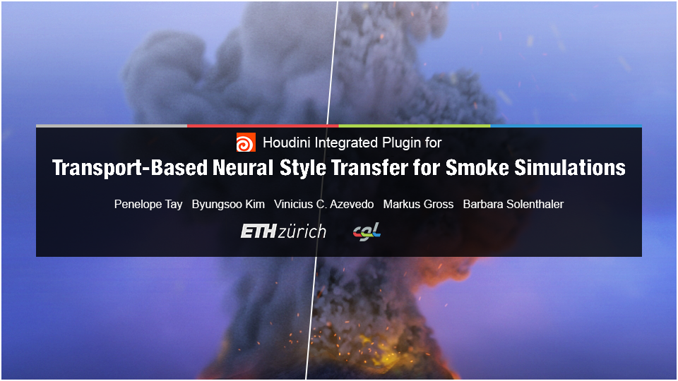
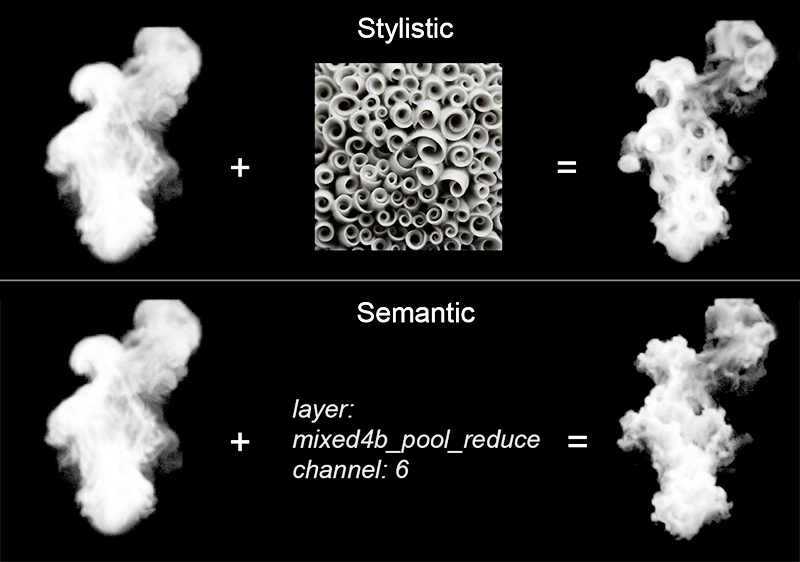
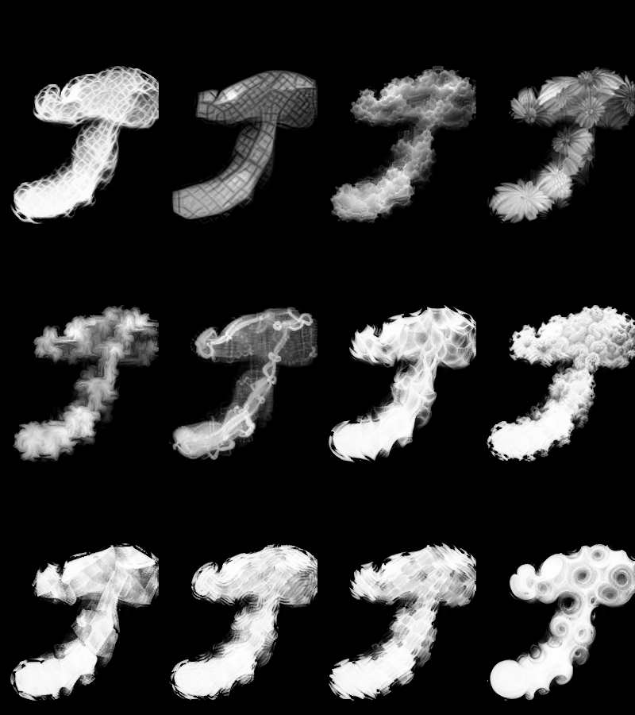
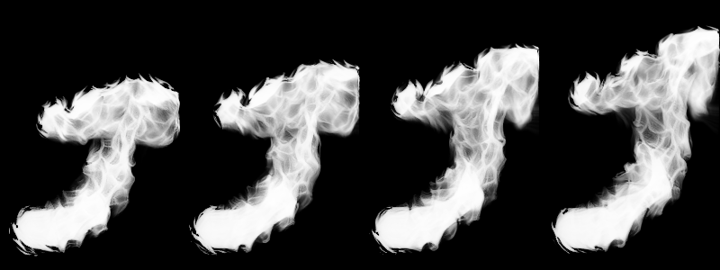

# Tensorflow implementation of Style Transfer for Houdini Smoke Simulations

An artist-centered tool for [Transport-Based Neural Style Transfer for Smoke Simulations](http://www.byungsoo.me/project/neural-flow-style). Combines the [original implementation](https://gitlab.com/kimby/neural-flow-style) with a Houdini Digital Asset, making a user-friendly, integrated plugin for Smoke Stylization.

Penelope Tay, [Byungsoo Kim](http://www.byungsoo.me), [Vinicius C. Azevedo](http://graphics.ethz.ch/~vviniciu/), [Markus Gross](https://graphics.ethz.ch/people/grossm), [Barbara Solenthaler](https://graphics.ethz.ch/~sobarbar/)

[Computer Graphics Laboratory](https://cgl.ethz.ch/), ETH Zurich

## Description
As an artist, this tool lets you take smoke simulations you've created in Houdini and stylize them. This gives them the aesthetic and apperance of your choice, whilst remaining governed by the physical accuracy of the simulation.

There are two types of transfer you can conduct: Stylistic and Semantic. Stylistic Transfer lets you specify a target image, whilst Semantic Transfer lets you specify a [target layer and channel](http://storage.googleapis.com/deepdream/visualz/tensorflow_inception/index.html). The stylizer will then alter the smoke to mimic the target.

## Installation

Python 3.6

Use this installation method unless you have very specific requirements

1. Ensure you have Python 3.6 installed and on your Environment Path. If not, [download it](https://www.python.org/downloads/release/python-360/).

2. Download the necessary libraries. Install these via command prompt:

        pip install --user --upgrade tensorflow-gpu==1.12 tqdm matplotlib Pillow imageio scipy scikit-image

3. Download [CUDA](https://developer.nvidia.com/cuda-90-download-archive) and [CuDNN](https://developer.nvidia.com/rdp/form/cudnn-download-survey) and add them on your Environment Path.
* You may need to create a NVIDIA Developer Account to download CuDNN.
* Please Download cuDNN v7.6.3 (August 23, 2019), for CUDA 9.0.

4. Open the command prompt and download our code:

        git clone https://gitlab.com/ozeuth/neural-flow-style.git

5. Ensure you have Houdini installed. If not, [download it](https://www.sidefx.com/download/).
* You do not need the commercial version.

Python 2.7

Whilst Houdini (as of 8/26/2019), runs off Python 2.7, you still need a second copy should you wish to proceed with this method. The reason being Tensorflow is not technically not supported for Python 2.7, and a special setup is required. 
This problem may be trivialised for Linux users, who benefit from both a flexible Python environment for Houdini and Tensorflow support for Python 2.7.

1. Ensure you have a Houdini-independent Python 2.7 installed and on your Environment Path. If not, [download it](https://www.python.org/download/releases/2.7/)

2. Download the necessary libraries. You must get [Numpy, Scipy](https://www.lfd.uci.edu/~gohlke/pythonlibs/#numpy), [Pillow](https://files.pythonhosted.org/packages/0e/81/158a63ff32ea444d4f858a9475da98a956ef5cd3011f677c6c5c8064efe5/Pillow-6.1.0-cp27-cp27m-win_amd64.whl) and [Tensorflow](https://github.com/fo40225/tensorflow-windows-wheel/blob/master/1.10.0/py27/GPU/cuda92cudnn72avx2/tensorflow_gpu-1.10.0-cp27-cp27m-win_amd64.whl) from these exact wheels, and install the rest via command prompt:

        pip install --user --upgrade tqdm matplotlib imageio scikit-image

* For numpy and scipy, install "numpy-1.16.4+mkl-cp27-cp27m-win_amd64.whl" and "scipy-1.2.2-cp27-cp27m-win_amd64.whl" respectively. Numpy must be installed first.
* You will receive incompatability warnings. Ignore them, they are not relevant in this particular context.
3. Download [CUDA](https://developer.nvidia.com/cuda-92-download-archive) and [CuDNN](https://developer.nvidia.com/rdp/form/cudnn-download-survey) and add them on your Environment Path.
* You may need to create a NVIDIA Developer Account to download CuDNN.
* Please Download cuDNN v7.6.3 (August 23, 2019), for CUDA 9.2.

4. Open the command prompt and download our code:

        git clone https://gitlab.com/ozeuth/neural-flow-style.git

5. Ensure you have Houdini installed. If not, [download it](https://www.sidefx.com/download/).
* You do not need the commercial version.

## Usage
1. Open a Houdini smoke simulation or [create one from scratch](https://www.youtube.com/watch?v=aMSJ1v6xCag). Regardless, you should have a "pyro_import" geometry node.
2. File > Import > Houdini Digital Asset..., navigate to the neural-flow-style directory and select a .hdanc file. Choose "smoke_stylizer.hdanc" if you do not intend to modify the Digital Asset, "smoke_stylizer_unlocked.hdanc" otherwise. Click Install.
3. Enter the "pyro_import" geometry node. In the /obj/pyro_import Network view, Add > Node > Digital Assets > Smoke stylizer.
4. Connect the "import pyrofields" node's output to the input of our "Smoke_Stylizer_Oz" node.

5. Click on the Smoke Stylizer digital asset. Set the "Python version" and "Python Path" (e.g., `C:\Users\user_name\AppData\Local\Programs\Python\Python36`) to that of the Houdini-independent python you have installed. Set the "Stylizer Path" (e.g., `C:\Users\user_name\dev\neural-flow-style`) to that of the neural-flow-style you have installed. 

6. Tweak other details as you wish. Otherwise, click "New Stylization". Stylization will begin on the next frame after.

* If confused, you may refer to our example scene, demo.hipnc

## Results (single frame)

## Results (sequence)

